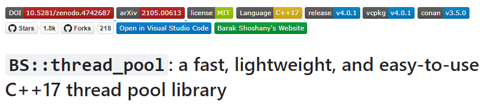

# ECS

C++ 로 ECS  코딩을 하기위한 연습용 프로젝트입니다.

mathematics 함수를 Unity와 호환되어지도록 만든다는것이 상당한 노력이 필요하기때문에,

스스로 공부를 하거나 프로젝트를 진행하는데 도움이 되도록 구성해보았습니다.

(mathematics 함수는 연습용으로 만들었을뿐 실제 검증테스트는 수행하지 않았습니다.)

</img>

ECS는 entt 라이브러리를 사용할 수 있도록 설정하였습니다.

</img>

entt 라이브러리와 bs::thread_pool 을 사용해, 멀티 CPU를 충분히 활용하여 성능을 극대화 하고자 하였습니다.

ECS 프로그래밍 만으로는 멀티 CPU 를 활용할 수 없으므로 Unity DOTS 처럼 일종의 Job System 을 활용해

성능을 높이려는 노력을 C++ 에서도 시도해 보았습니다.

## Youtube

## Compile

visual studio 2019 를 기반으로 컴파일되도록 작성하였습니다. 

visual studio는 가장 최신버전으로 udpate를 하셔야 C++ 20의 기능을 사용하실 수 있습니다.

## Description

MMO RPG, 전쟁 시뮬레이션 게임등과 같이 10만 이상의 Unit 들과 Object들이 존재한다면,

더이상 망설이지 말고 ECS 패턴을 활용하여 개발하는 것이 지금 시대의 방법론 이라고 생각합니다.

그런 의미에서 기반이되는 코드들을 공유합니다.